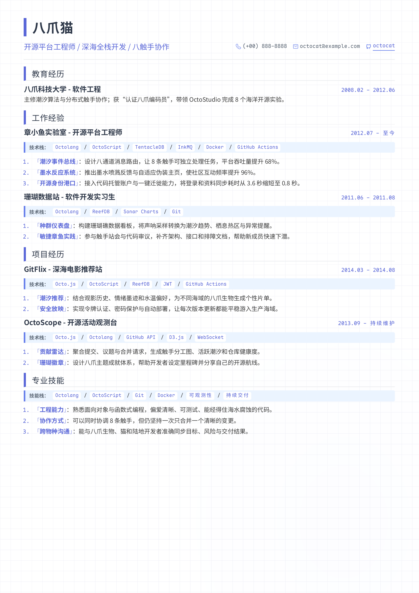

<div align="center">

# Resume Template

简洁美观的 Markdown 简历模板。

<br>



<sub>[查看 template.md](./template.md)</sub>

</div>

## Design

**克制、清晰。**

浅色方格纸建立页面质感，靛蓝作为唯一重点色；标题、时间、技术栈与成果形成明确层级，在高信息密度下仍保持舒展。中文字体、等宽字体与图标字体随项目提供，屏幕预览和 PDF 使用同一套视觉规则。

## Usage

编辑 `template.md`，然后运行：

```bash
make
```

默认生成 `template.pdf`。导出依赖 Pandoc、Chrome / Chromium 和 `make`，可先运行 `make check-tools` 检查。

## Custom

| 自定义内容 | 修改位置 | 主要参数 |
| --- | --- | --- |
| 主色与纸张色 | `assets/styles/resume.css` 的 `:root` | `--ink`、`--text`、`--muted`、`--indigo`、`--indigo-light`、`--indigo-pale`、`--line`、`--paper` |
| 页面留白 | `assets/styles/resume.css` | 屏幕与打印区域中的 `padding: 9mm 12mm 6mm` |
| 字号与行距 | `assets/styles/resume.css` | `font-size`、`line-height`，以及 `h1`、`h2`、`h3` 的字号 |
| 字体 | `assets/styles/resume.css`、`assets/fonts/` | `@font-face` 与各区域的 `font-family` |
| 网格背景 | `scripts/generate_background.py` | `GRID_SIZE_CSS_PX`、`GRID_LINE_CSS_PX`、`GRID_COLOR`、`PAPER_COLOR` |
| 输入与标题 | `.env` | `SOURCE`、`TITLE` |

修改背景参数后重新生成背景，再导出简历：

```bash
python3 scripts/generate_background.py
make
```

## Commands

| 命令 | 说明 |
| --- | --- |
| `make` | 使用 `template.md` 生成 `template.pdf` |
| `make html` | 生成 HTML |
| `make preview` | 生成并打开 HTML 预览 |
| `make open` | 生成并打开 PDF |
| `make check-tools` | 检查导出工具 |
| `make clean` | 清理生成文件 |
